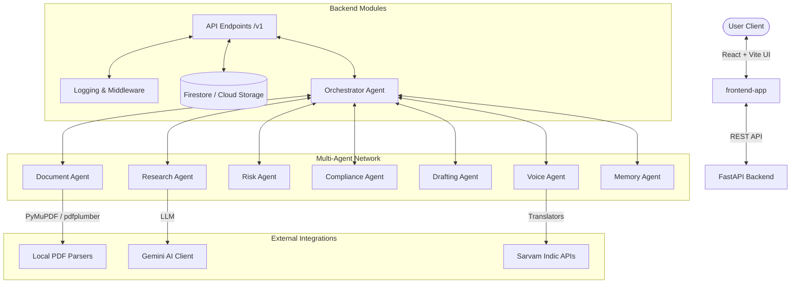

# LawGPT AI OS ⚖️🤖

LawGPT AI OS is an advanced legal management system built to automate legal workflows, document parsing, risk assessment, contract drafting, and multi-agent coordination with natural language and Indic voice support.

---

## 🏛️ System Architecture

The application is structured as a decoupled web system built using a modern, fast, and type-safe stack:



---

## 📂 Project Directory Structure

```
├── .vscode/               # VS Code workspace settings
├── backend/               # FastAPI Backend Service
│   ├── app/
│   │   ├── agents/        # Orchestrator & sub-agent skeletons
│   │   ├── api/           # API endpoints (v1 routes)
│   │   ├── core/          # App configuration, security, exception handling, logging
│   │   ├── database/      # Firestore & Cloud Storage connection clients
│   │   ├── services/      # Independent helper integration layers (Gemini, RAG, Sarvam, PDF)
│   │   └── main.py        # Application startup & middleware setup
│   ├── tests/             # Pytest suite
│   ├── Dockerfile         # Multi-stage production container build
│   ├── docker-compose.yml # Container definitions
│   └── requirements.txt   # Package dependencies
├── frontend-app/          # React/Vite/TS/Tailwind Frontend
├── docs/                  # Project specifications & diagrams
├── docker-compose.yml     # Workspace orchestration file
└── pyrefly.toml           # Pyrefly Static Type Checker configuration
```

---

## 🚀 Getting Started

### Prerequisites
- **Python 3.12+**
- **Node.js 18+** / **Bun** (for frontend)
- **Docker** and **Docker Compose** (optional)

---

### 1. Backend Setup

1. Navigate to the backend directory:
   ```bash
   cd backend
   ```
2. Create and activate a Python virtual environment:
   ```bash
   python3 -m venv .venv
   source .venv/bin/activate
   ```
3. Install the dependencies:
   ```bash
   pip install -r requirements.txt
   ```
4. Copy the environment configuration file:
   ```bash
   cp .env.example .env
   ```
   *Edit the `.env` file to insert your specific AI keys and database paths.*

5. Run development server:
   ```bash
   uvicorn app.main:app --reload --port 8000
   ```
   *The Swagger UI documentation is available at [http://localhost:8000/docs](http://localhost:8000/docs).*

---

### 2. Frontend Setup

1. Navigate to the frontend directory:
   ```bash
   cd frontend-app
   ```
2. Install package dependencies:
   ```bash
   npm install   # or: bun install
   ```
3. Start the Vite development server:
   ```bash
   npm run dev   # or: bun dev
   ```
   *The client web portal will run on [http://localhost:5173](http://localhost:5173) or [http://localhost:8080](http://localhost:8080).*

---

### 3. Docker Compose Setup (Workspace Root)

Build and run both services from the root of the workspace:
```bash
docker compose up --build
```

---

## 🛣️ API Endpoints Summary

All routes are versioned and prefix-nested under `/api/v1`:

- **System Health**:
  - `GET /api/v1/health` - Check API and environment configuration.
  - `GET /api/v1/ready` - Verify database and cloud service connectivity.
  - `GET /api/v1/live` - Verify engine liveness.
  - `GET /api/v1/version` - Retrieve application details.

- **Modular Domain Agents**:
  - `GET /api/v1/agents` - Query registered sub-agent metadata and capabilities.
  - `POST /api/v1/chat` - Interact with the Orchestrator Chat Agent.
  - `POST /api/v1/documents/upload` - Upload and analyze legal documents.
  - `POST /api/v1/research/query` - Perform legal query research tasks.
  - `POST /api/v1/compliance/verify` - Verify SEBI, FEMA, or labor codes against operations.
  - `POST /api/v1/draft/generate` - Draft legal letters and contracts.
  - `POST /api/v1/voice/transcribe` - Transcribe voice clips or translate text values.

---

## 🛠️ Verification & Quality Assurance

The backend repository complies with rigorous typing and style checking specifications.

- **Run Type Checks**:
  ```bash
  mypy backend
  ```
- **Run Style & Formatting Linters**:
  ```bash
  black --check backend/app
  ruff check backend/app
  ```
- **Run Suite Verification**:
  ```bash
  pytest backend/tests/
  ```
